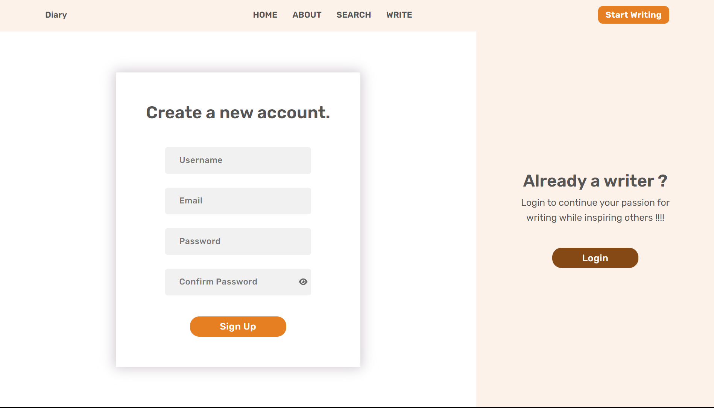
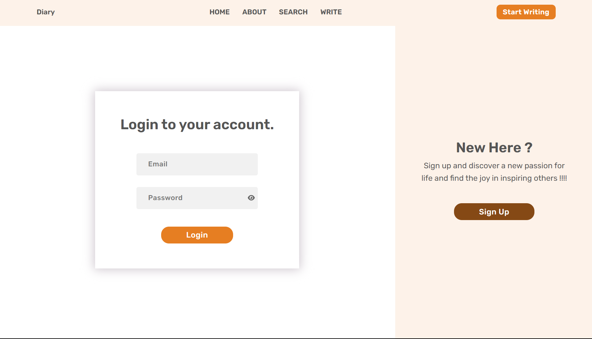
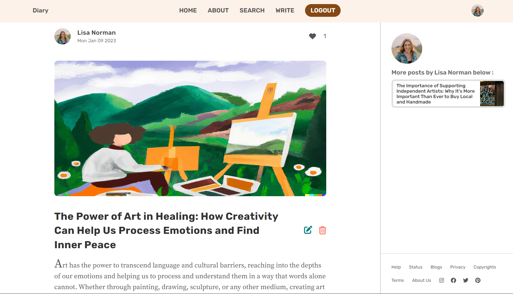
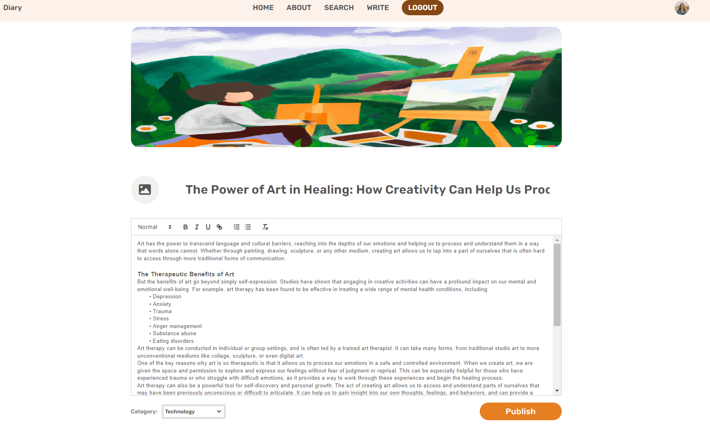
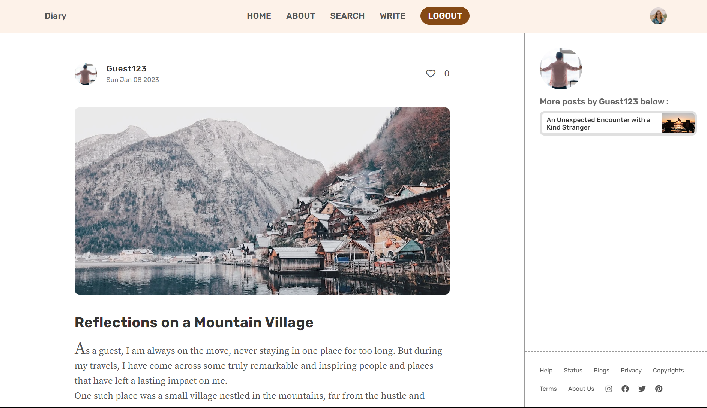
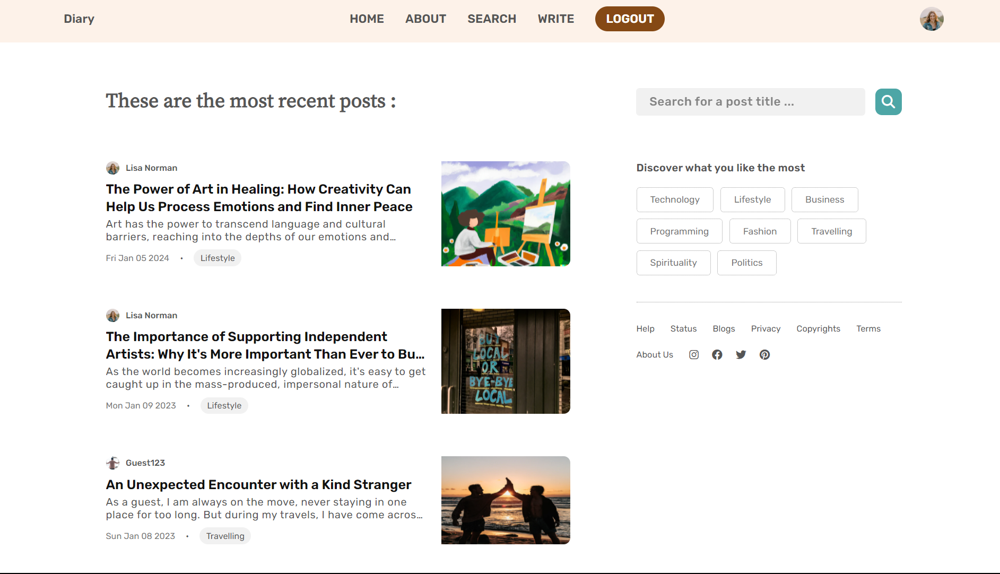

### Dairy App

This is a personal project based on Blogging Application which includes all the major functionality a CRUD application has with some other important features like authentication and atuthorization.

#### Basic Technology used

- ReactJs for frontend
- NodeJs with ExpressJs for backend and api server
- MongoDB for Database
- JWT and cookies for authentication

#### How to start the project in your local dev

Tho, this by any means this is not production ready application, if you want you could follow the steps given below to have the same project in your local env. Incase, you just directly want to take how the application looks like you can visit below for corresponding pictures.

##### Steps for local dev

- Clone the repo in particular dir
- cd into api folder
- do "npm install" to install all the nodes dependencies.
- Also create a .env file with different env variables and link it to the project
- This env vars are used to start db connection and some other variables loading like jwt secret
- now run "npm run start" which will start a nodemon dev server for api on port 3000
- Now go to the client dir
- install all the dependencies using "npm install"
- run command "npm start" to have a localhost server serve react application for you on any port you like

PS: This project takes many refernces and inspirations from different online internet platforms for design and dev.

#### Images from application

`Home Page 1`

`Home Page 2`

`Signup Page`

`Login Page`

`Single Post Page when author is logged in`

`When author edits the post`

`Single Post Page when somebody else is logged in`

`Search page`

`Search page with some filter`

`Image of about page`
;
